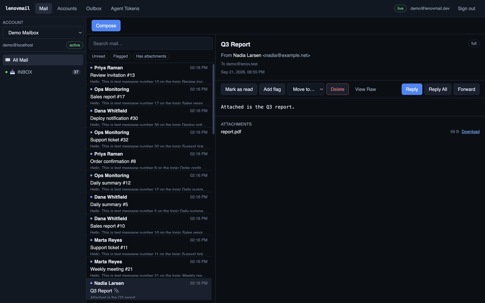
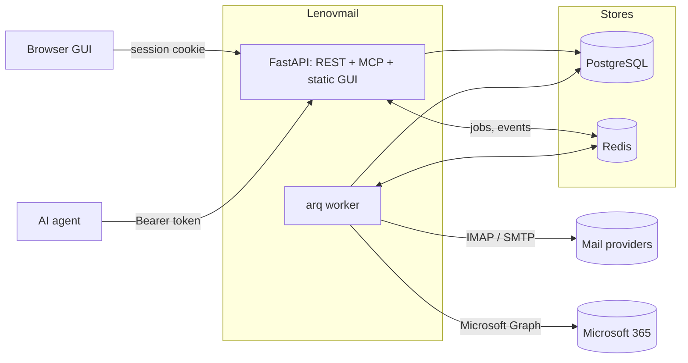
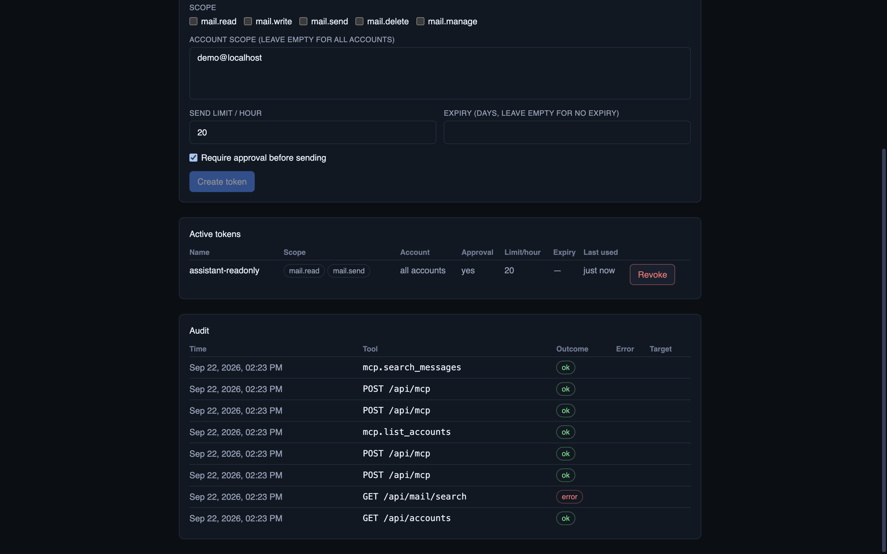
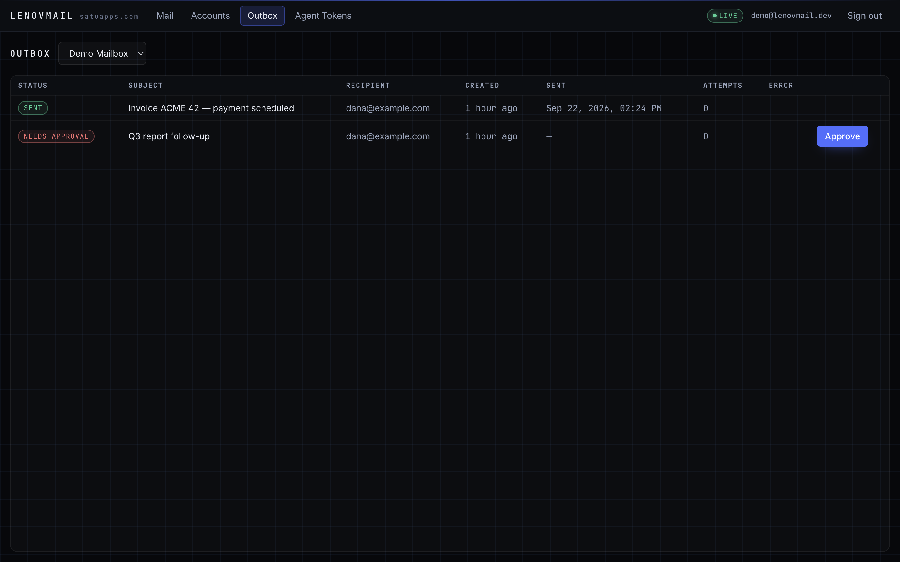
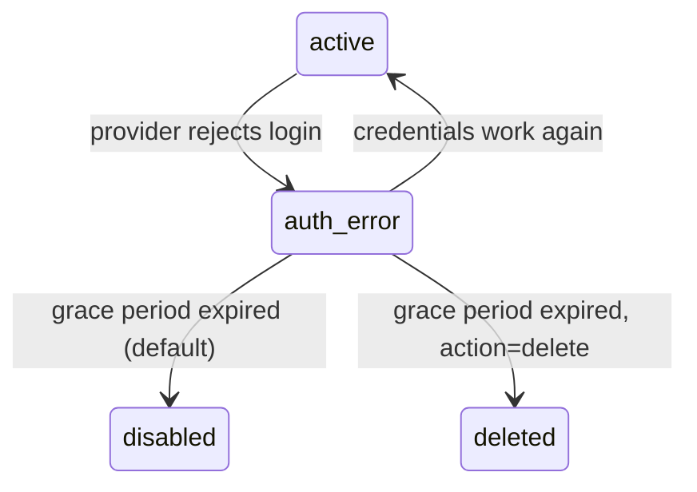

# Lenovmail

Self-hosted mail infrastructure for many mailboxes at once — IMAP and Microsoft Graph behind a
single database, a browser client, a REST API, and an MCP server that lets AI agents read and
send mail under limits you can audit.

[](https://github.com/satuapps/lenovmail/actions/workflows/ci.yml)
[](LICENSE)




## What it does

Lenovmail keeps a normalized copy of your mailboxes in PostgreSQL. IMAP accounts sync
incrementally (UIDVALIDITY, CONDSTORE when the server offers it, IDLE for the inbox);
Microsoft 365 accounts sync through Graph delta links. Messages are parsed once, stored with
their MIME blob on disk, threaded by `References`/`In-Reply-To`, and indexed for full-text
search. Everything the GUI can do is also reachable over REST, and a scoped subset is exposed
to AI agents over MCP.

It is built for the case where mail is an input to automation: several accounts, one API, and
an agent that must not be able to quietly send a thousand emails.

## Why it is different

| | |
| --- | --- |
| **Agent-native, not agent-bolted-on** | Scoped tokens, per-account restrictions, hourly send limits, mandatory human approval, and an audit row for every call — REST and MCP alike. |
| **Two providers, one schema** | IMAP and Graph accounts produce the same `messages`/`folders`/`threads` rows, so downstream code never branches on provider. |
| **Configuration discovery that actually resolves** | Bundled overrides → `autoconfig.<domain>` → `.well-known` → ISPDB → MX → SRV (RFC 6186) → hostname probing, with negative results cached. |
| **Self-healing account state** | A janitor re-checks rejected credentials, restores the ones that recover, and retires the ones that stay dead instead of retrying them forever. |
| **No message loss on parallel sends** | Outbox rows are claimed with `FOR UPDATE SKIP LOCKED`; two workers cannot deliver the same message twice. |

## Quickstart

```bash
git clone https://github.com/satuapps/lenovmail.git
cd lenovmail
cp .env.example .env
python -c "import os,base64;print(base64.b64encode(os.urandom(32)).decode())"   # -> LENOVMAIL_SECRET_KEY

docker compose up -d --build
docker compose exec api uv run lenovmail bootstrap-admin --email admin@example.com
```

Open <http://localhost:8080>, sign in with the printed password, and add an account. API
documentation is served at <http://localhost:8080/api/docs>.

No mailbox to test with? Start the bundled fake server and seed it:

```bash
docker compose -f docker-compose.test.yml up -d
uv run python scripts/seed_greenmail.py
```

Full walkthrough: [docs/quickstart.md](docs/quickstart.md).

## Architecture



The API process serves the REST API, the built React client, and the MCP endpoint. The worker
process runs sync cycles, body backfill, IMAP IDLE watchers, outbox delivery, and the janitor.
Redis carries the job queue and the SSE fan-out; PostgreSQL holds everything else.

Details: [docs/architecture.md](docs/architecture.md).

## Agents and MCP

```json
{
  "mcpServers": {
    "lenovmail": {
      "type": "http",
      "url": "http://localhost:8080/api/mcp",
      "headers": { "Authorization": "Bearer lnv_..." }
    }
  }
}
```

Tools: `list_accounts`, `list_folders`, `search_messages`, `get_message`, `get_thread`,
`set_message_flags`, `move_message`, `delete_message`, `send_message`, `list_outbox`,
`get_attachment`.

A token carries scopes (`mail.read`, `mail.write`, `mail.send`, `mail.delete`, `mail.manage`),
an optional account allowlist, an hourly send budget, and an approval flag. With approval on,
`send_message` stops at `pending_approval` and waits for a human in the Outbox view. Every call
lands in `agent_audit`.



Sends queued by an agent wait in the Outbox until a human approves them:



Details: [docs/agents.md](docs/agents.md).

## Maintenance built in

Credentials die quietly: an app password gets revoked, a tenant pulls an OAuth grant, an account
is closed. The janitor (`janitor_sweep`, hourly) re-checks every account the sync path marked
`auth_error`:



Transient failures never count — a timeout or a 5xx leaves the account exactly where it was.
Expired and revoked agent tokens are deleted after their retention window, and `agent_audit` is
trimmed to its own. Run it by hand with `uv run lenovmail janitor`.

Details: [docs/operations.md](docs/operations.md).

## CLI

| Command | Purpose |
| --- | --- |
| `lenovmail bootstrap-admin --email ...` | Create or update the admin user; prints a generated password once |
| `lenovmail discover user@domain` | Run the discovery chain and print the resolved settings |
| `lenovmail sync --email user@domain` | One sync cycle in the foreground, no worker needed |
| `lenovmail agent-token --email ... --scopes mail.read,mail.send` | Issue an agent token (shown once) |
| `lenovmail show-account user@domain` | Folders, message counts, last sync cycles |
| `lenovmail janitor [--action disable\|delete]` | Run one maintenance sweep now |
| `lenovmail serve [--port 8080]` | Run the API and GUI |

## Documentation

| Page | Contents |
| --- | --- |
| [Quickstart](docs/quickstart.md) | Clone to first synced inbox, including a local test mailbox |
| [Architecture](docs/architecture.md) | Processes, schema, sync cycles, delivery path |
| [Configuration](docs/configuration.md) | Every `LENOVMAIL_*` variable, defaults, and when to change it |
| [Operations](docs/operations.md) | Jobs and cron, janitor lifecycle, health checks, troubleshooting |
| [Agents](docs/agents.md) | Tokens, scopes, approval flow, MCP tool reference |
| [REST API](docs/api.md) | Endpoint reference, pagination, error shape |
| [Deployment](docs/deployment.md) | TLS, scaling, volumes, Microsoft app registration |

## Development

```bash
uv sync
docker compose up -d db redis
uv run alembic upgrade head
uv run uvicorn lenovmail.api.app:app --reload --port 8080
uv run arq lenovmail.workers.main.WorkerSettings     # second terminal
npm --prefix web run dev                             # GUI with a proxy to :8080
```

Checks that CI runs: `uv run ruff check src tests`, `uv run mypy`, `uv run pytest -q`,
`npm --prefix web run typecheck`, `npm --prefix web run build`. Database-backed tests skip
themselves when PostgreSQL is not reachable; the IMAP end-to-end suite needs
`docker compose -f docker-compose.test.yml up -d`.

See [CONTRIBUTING.md](CONTRIBUTING.md).

## Security

Stored IMAP/SMTP passwords and Microsoft token caches are encrypted with AES-256-GCM using a
per-field AAD derived from the account id; rotating `LENOVMAIL_SECRET_KEY` makes existing
credentials undecryptable. Browser sessions live in Redis so they can be revoked; agent tokens
are stored as sha256 hashes and displayed once. Incoming HTML is sanitized server-side (nh3) and
again in the client (DOMPurify). `LENOVMAIL_ALLOWED_HOSTS` gates the `Host` header for the API
and the MCP mount alike.

Reporting a vulnerability: [SECURITY.md](SECURITY.md).

## License

MIT — see [LICENSE](LICENSE).

---

Built and maintained by [satuapps](https://github.com/satuapps).
