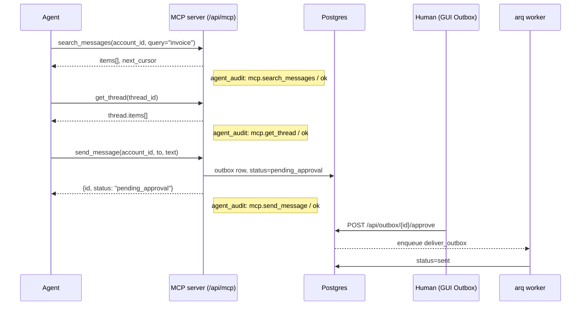

# AI agent access

Lenovmail exposes every mailbox it syncs to AI agents over two transports that share one
identity: a bearer token issued from the `agent_tokens` table.

- **REST** — `Authorization: Bearer lnv_...` on any `/api/*` route (see `docs/api.md`).
- **MCP** — the same token against the Streamable HTTP server mounted at `/api/mcp`
  (`src/lenovmail/mcp/server.py`).

Token lookup, scope, per-token account restriction, expiry, and revocation are enforced
identically on both transports (`src/lenovmail/api/deps.py:load_agent`,
`src/lenovmail/mcp/auth.py:resolve_agent`). A token is rejected if it is revoked
(`revoked_at` set) or past `expires_at`.

## Issuing a token

### GUI

Top nav → **Agent Tokens** (`AgentTokensPage`, route `/agent`) creates a token via
`POST /api/agent/tokens`. The plaintext token is shown once, in the response; only its
SHA-256 hash (`token_hash`) is stored, so a leaked database dump does not hand out
access by itself (`src/lenovmail/api/security.py:new_agent_token`).

### CLI

```
uv run lenovmail agent-token --email you@example.com --name agent --scopes mail.read,mail.send --days 90
```

`src/lenovmail/cli.py:agent_token_cmd`. `--scopes` is a comma-separated list, `--days` is
the token lifetime (`expires_at = now + days`). The CLI path does not support
`account_ids`, `require_send_approval`, or `send_limit_per_hour` — it always creates an
unrestricted, approval-required (model default `true`, but the CLI does not set it
explicitly so the column's server default of `true` applies) token at the `agent_tokens`
table's own default send limit (server default `20`, the same value `POST /api/agent/tokens`
falls back to via `LENOVMAIL_AGENT_SEND_LIMIT_PER_HOUR`). Use the GUI or
`POST /api/agent/tokens` directly for the finer-grained options.

Tokens are prefixed `lnv_`.

## Scopes

Five scopes exist (`src/lenovmail/api/deps.py:ALL_SCOPES`). A browser session (cookie
login) always holds all five; an agent token holds exactly the set chosen at creation.

| Scope | Unlocks |
|---|---|
| `mail.read` | Every MCP read tool: `list_accounts`, `list_folders`, `search_messages`, `get_message`, `get_thread`, `list_outbox`, `get_attachment`. |
| `mail.write` | `set_message_flags`, `move_message`. |
| `mail.send` | `send_message` (and the REST `POST /api/accounts/{id}/outbox`). |
| `mail.delete` | `delete_message`. |
| `mail.manage` | REST only — account creation/update/delete, discovery, and the Microsoft OAuth start redirect (`POST/PATCH/DELETE /api/accounts...`, `POST /api/accounts/discover`, `GET /api/oauth/microsoft/start`). No MCP tool requires it. |

Enforcement is the same on both transports: every MCP tool calls `principal.require(scope)`
before doing anything (`mcp/server.py`), and every REST route either calls it directly
(`update_flags`, `move_message`, `delete_message`, `queue_outbox`, `create_account`, …) or
declares `Depends(require_read)` for the routes that return mailbox content (folders,
messages, bodies, raw MIME, attachments, threads, outbox listings, account listings). A
token that holds only `mail.send` therefore cannot page through the mailbox over REST.
Account ownership and the token's account allowlist are checked on top of the scope.

Unknown scope names are rejected at token-creation time
(`400 unknown scope: [...]`, `api/routes/agent.py:create_token`); at least one scope is
required.

## Per-token account restriction

`AgentTokenCreate.account_ids` (optional list of account UUIDs) is stored on the token.
`None` means every account the owner has; a non-empty list restricts the token to
exactly those accounts. `Principal.ensure_account` (REST) and
`AgentPrincipal.ensure_account` (MCP) both reject an out-of-scope account with an error
before any query runs. `create_token` also verifies every listed account is actually
owned by the caller, so a token can never be scoped to someone else's mailbox.

## Send approval

`AgentToken.require_send_approval` defaults to `true` (both the GUI form and the
database column default). When set:

- MCP `send_message` and REST `POST /api/accounts/{id}/outbox` still create the
  `outbox` row, but with `status = "pending_approval"` instead of `queued`
  (`sync/outbox.py:queue`). No delivery job is enqueued for a pending row.
- A human approves it from the GUI's **Outbox** page, which calls
  `POST /api/outbox/{outbox_id}/approve` (requires `mail.send` on the *caller's* session
  — this is normally the browser session, not the agent token). Approval flips the row
  to `queued` (`sync/outbox.py:approve`) and the next `send_pending` pass picks it up.
- If `require_send_approval` is `false`, the message goes straight to `queued` and a
  `deliver_outbox` job is enqueued immediately.

## Send limit

`AgentToken.send_limit_per_hour` (default `LENOVMAIL_AGENT_SEND_LIMIT_PER_HOUR`, itself
defaulting to `20`) caps how many outbox rows a single token may create per rolling
hour. `enforce_agent_send_limit` (`sync/outbox.py`) counts `outbox` rows with
`created_by_token_id = <this token>` and `created_at >= now - 1h`; once the count
reaches the limit, the next send attempt raises `SendLimitExceeded` — a tool error over
MCP, `429 Too Many Requests` over REST. The count includes rows still sitting in
`pending_approval`: approval doesn't reset the clock, queuing does.

## Audit trail

Every call is written to `agent_audit` (`models/agent.py:AgentAudit`):
`id, token_id, user_id, tool, params_digest, target_ids, outcome, error, created_at`.
`outcome` is one of `ok`, `denied`, `error`.

- **MCP** calls are logged inside `_agent_session` (`mcp/server.py`), one row per tool
  invocation, named `mcp.<tool>` — e.g. `mcp.send_message`, `mcp.get_thread`. A
  `ToolError` (scope/account/limit denial) is logged with `outcome="denied"`; any other
  exception is `outcome="error"`; a normal return is `outcome="ok"`. Audit failures
  never fail the underlying call.
- **REST** calls made with a bearer token are logged by ASGI middleware
  (`api/app.py:audit_agent_calls` / `_record_agent_call`), one row per HTTP request,
  named `"<METHOD> <path>"` — e.g. `GET /api/accounts/123.../messages`. `outcome` is
  derived from the response status: `ok` under 400, `denied` for 401/403, `error`
  otherwise. `params_digest` is a truncated SHA-256 of the query string (not stored in
  full); `target_ids` are the path segments that look like UUIDs.
- Browser-session (cookie) calls are **not** audited — only bearer-token calls are.

The GUI's Agent page reads this table through `GET /api/agent/audit`.

## Expiry, revocation, and the janitor

`DELETE /api/agent/tokens/{token_id}` sets `revoked_at` rather than deleting the row, so
the audit trail can still be explained after the fact. `load_agent` rejects a token
whose `revoked_at` is set or whose `expires_at` has passed, on every request.

The janitor (`src/lenovmail/maintenance.py`, `uv run lenovmail janitor` or the hourly
arq cron job `janitor_sweep`, scheduled at minute 17) then reclaims dead rows:

- `purge_agent_tokens` deletes tokens that are both revoked-or-expired **and** past
  `revoked_at`/`expires_at` + `LENOVMAIL_JANITOR_TOKEN_RETENTION_DAYS` (default `7`).
  The retention window exists so an operator can still see and explain a token that was
  revoked an hour ago.
- `purge_agent_audit` deletes `agent_audit` rows older than
  `LENOVMAIL_JANITOR_AUDIT_RETENTION_DAYS` (default `90`; `0` keeps every row forever).

The same pass also re-checks accounts stuck in `auth_error`, restores them to `active`
on a successful credential check, and — after
`LENOVMAIL_JANITOR_ACCOUNT_GRACE_DAYS` (default `14`) of continued rejection — disables
or deletes the account per `LENOVMAIL_JANITOR_ACCOUNT_ACTION` (default `disable`). This
is unrelated to token lifecycle but shares the same sweep and CLI command:

```
uv run lenovmail janitor --action disable   # or: --action delete
```

## MCP tools

All tools are defined in `src/lenovmail/mcp/server.py` and share output shapes with the
REST serializers, so an agent and the GUI see identical field names for the same data.
Every tool requires a valid agent token (`request has no agent token` otherwise) and is
implicitly scoped to accounts the token's owner owns and, if set, the token's
`account_ids`.

| Tool | Scope | Arguments | Returns |
|---|---|---|---|
| `list_accounts` | `mail.read` | *(none)* | `{"accounts": [AccountOut, ...]}` — accounts owned by the token's user, filtered to the token's `account_ids` if set. |
| `list_folders` | `mail.read` | `account_id` | `{"folders": [FolderOut, ...]}` |
| `search_messages` | `mail.read` | `account_id`, `query?`, `folder_id?`, `unread?`, `flagged?`, `has_attachments?`, `limit=25` (clamped 1-100), `cursor?` | `{"items": [MessageOut, ...], "next_cursor": str \| None}` |
| `get_message` | `mail.read` | `message_id`, `include_body=true` | `{"message": MessageOut, "body"?: BodyOut}` |
| `get_thread` | `mail.read` | `thread_id` | `{"thread": ThreadOut}` (all messages in the conversation, ordered by time) |
| `set_message_flags` | `mail.write` | `message_id`, `seen?`, `flagged?` (at least one required) | `{"message": MessageOut}` |
| `move_message` | `mail.write` | `message_id`, `folder_id` | `{"status": "moved", "message_id", "folder_id"}` |
| `delete_message` | `mail.delete` | `message_id` | `{"status": "deleted", "message_id"}` |
| `send_message` | `mail.send` | `account_id`, `to` (list, required), `subject=""`, `text?`, `html?` (one of `text`/`html` required), `cc?`, `bcc?`, `in_reply_to?`, `references?`, `attachments?` (list of `{filename, mime_type, content_b64}`) | `{"id", "status", "requires_approval", "to", "subject"}` — `status` is `pending_approval` or `queued` |
| `list_outbox` | `mail.read` | `account_id`, `limit=20` (clamped 1-100) | `{"items": [{"id","status","subject","to","attempts","last_error","created_at","sent_at"}, ...]}` |
| `get_attachment` | `mail.read` | `message_id`, `attachment_id`, `max_bytes=1000000` | `{"message_id","attachment_id","filename","mime_type","size_bytes","content_b64","truncated"}` — `content_b64` is `null` and `truncated` is `true` when the attachment exceeds `max_bytes`; fetch it over REST instead. |

The sender on `send_message` is always the account's own address — it cannot be
overridden by the caller.

## MCP client configuration

```json
{
  "mcpServers": {
    "lenovmail": {
      "type": "http",
      "url": "http://localhost:8080/api/mcp",
      "headers": { "Authorization": "Bearer lnv_..." }
    }
  }
}
```

The endpoint is stateless Streamable HTTP (`mcp/server.py:build_mcp_app`), so no
session affinity or reconnect handling is required on the client side.

## End-to-end example

An agent with `mail.read` + `mail.send` (and `require_send_approval=true`) searches an
account, reads a thread, and queues a reply that a human must approve before it sends.



---
Maintained by [satuapps](https://satuapps.com).
