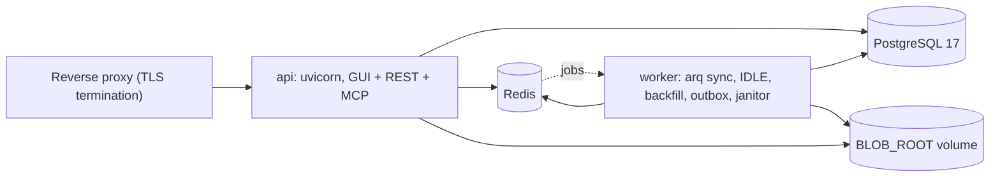

# Deployment

This covers running Lenovmail somewhere other than a laptop: TLS, scaling the API/worker split,
persistent storage, migrations, secret rotation, and Microsoft Graph app registration. It assumes
you've already read [quickstart.md](quickstart.md) and have a working local stack.

## Topology

Two Python processes share one Postgres database, one Redis instance, and one blob directory:



`api` serves the GUI (built `web/dist`), the REST API, and the MCP server (`/api/mcp`) from one
FastAPI app (`src/lenovmail/api/app.py`). `worker` runs arq jobs registered in
`src/lenovmail/workers/main.py`: `sync_account`, `sync_all_accounts` (cron, every 30s),
`ensure_idle_watchers` (cron, every 5 minutes), `idle_watch`, `backfill_bodies`,
`deliver_outbox`, and `janitor_sweep` (cron, hourly at minute 17). `api` only talks to IMAP or
Graph directly for synchronous, user-initiated checks — the login verification on account
creation and the **Test connection** button (`POST /api/accounts/{id}/test`); ongoing sync,
IDLE, body backfill, and outbox delivery are entirely the worker's job.

## Reverse proxy and TLS

The app itself serves plain HTTP on `:8000` inside the container (`:8080` on the host via the
default `docker-compose.yml` mapping). Put a TLS-terminating proxy in front of it for anything
reachable outside your machine. Two settings matter once you do:

- **`LENOVMAIL_PUBLIC_BASE_URL`** (default `http://localhost:8080`) — drives the `Secure` cookie
  flag on the session cookie. `Settings.cookies_secure` is literally `public_base_url.startswith
  ("https://")` (`src/lenovmail/config.py`), and `auth.py`'s `_set_session_cookie` passes that
  straight to `secure=`. Set this to your real `https://` origin, or the browser cookie is sent
  over plain HTTP and some browsers will refuse a cross-scheme `Secure` cookie mismatch. It also
  feeds the Microsoft OAuth redirect URI (see below) and the GUI redirects issued after OAuth
  callback and account creation.
- **`LENOVMAIL_ALLOWED_HOSTS`** (default `localhost:8080,127.0.0.1:8080,localhost,127.0.0.1`) —
  a comma-separated allowlist passed to Starlette's `TrustedHostMiddleware`
  (`app.add_middleware(TrustedHostMiddleware, allowed_hosts=settings.allowed_host_list)`). This
  applies to every route, including `/api/mcp` since the MCP app is mounted after this
  middleware. A request whose `Host` header isn't in the list gets a `400 Invalid host header`
  before it reaches any route — set this to your public hostname(s), e.g.
  `LENOVMAIL_ALLOWED_HOSTS=mail.example.com`.

Example proxy config (Caddy, auto-TLS) assuming the proxy runs as another container on the same
compose network as `api`:

```
mail.example.com {
	reverse_proxy api:8000
}
```

With nginx instead, forward `Host`/`X-Forwarded-Proto` so `LENOVMAIL_ALLOWED_HOSTS` sees the
public hostname and `LENOVMAIL_PUBLIC_BASE_URL` stays consistent:

```nginx
location / {
    proxy_pass http://api:8000;
    proxy_set_header Host $host;
    proxy_set_header X-Forwarded-Proto $scheme;
}
```

## Scaling

- **`api`** is stateless (sessions live in Redis, nothing is cached in-process), so it's safe to
  run more than one replica behind the proxy. `docker-compose.yml` ships one; add replicas with
  `docker compose up -d --scale api=2` (drop the published host port from the override below
  first, since two containers can't both bind `8080`).
- **`worker`** — same story, and more likely to be the thing you scale. Run
  `docker compose up -d --scale worker=3`; every worker process connects to the same Redis queue
  and arq distributes jobs across them.
- **`LENOVMAIL_WORKER_MAX_JOBS`** (default `10`) is the number of concurrent job slots *per
  worker process* (`arq`'s `WorkerSettings.max_jobs = settings.worker_max_jobs`). This is the
  scaling knob that actually matters: `idle_watch` is a long-running job that holds one slot for
  as long as an IMAP account's inbox watcher stays connected — `ensure_idle_watchers` re-enqueues
  it every 5 minutes for any active IMAP account without a live watcher key in Redis
  (`idle:watch:<account_id>`). With the default of 10, a single worker process can watch roughly
  10 IMAP inboxes before it starves `sync_account`, `backfill_bodies`, and `deliver_outbox` of
  free slots (Graph accounts use delta polling instead of IDLE, so they don't consume a
  standing slot). Either raise `LENOVMAIL_WORKER_MAX_JOBS` or add worker replicas as the IMAP
  account count grows.
- **`LENOVMAIL_IMAP_MAX_CONN_PER_ACCOUNT`** (default `3`) bounds how many concurrent IMAP
  connections the pool opens for a single account (`providers/accounts.py`, passed as
  `max_connections` when the pool is built) — this is per-account, not global, and covers the
  short-lived connections used during a sync cycle (separate from the one long-lived IDLE
  connection).

## Persistent volumes

Two things need durable storage outside the container filesystem:

- **PostgreSQL data.** The bundled `db` service uses a named volume (`pgdata:/var/lib/postgresql/
  data` in `docker-compose.yml`, Postgres 17). Outside Docker, point
  `LENOVMAIL_DATABASE_URL` at a managed or self-run Postgres 17 instance with its own backup
  policy — nothing in the app manages backups.
- **`LENOVMAIL_BLOB_ROOT`** (default `./var/blobs` locally, overridden to
  `/var/lib/lenovmail/blobs` for the `api`/`worker` containers, both mounted to the same named
  `blobs` volume). This holds every raw MIME message, gzip'd and content-addressed by the SHA-256
  of the raw bytes (`blobs.py`: `BLOB_ROOT/<hex[0:2]>/<hex[2:4]>/<hex>.eml.gz`). Two folders or
  accounts that received byte-identical mail share one file. By the same module's own docstring,
  **blobs are never deleted in v1** even when the owning message row is deleted — plan capacity
  for the raw size of everything ever synced, not just what's currently visible, and mount this
  on storage that grows, not a container's ephemeral layer.

Both `api` and `worker` need read/write access to the same blob volume — `api` serves raw
message downloads and attachment extraction from it, `worker` writes to it during sync.

## Running migrations on deploy

The image bundles `migrations/` and `alembic.ini` (`Dockerfile` copies both). The default `api`
service command is `sh -c "alembic upgrade head && exec uvicorn lenovmail.api.app:app --host
0.0.0.0 --port 8000"` — migrations are idempotent, so `docker compose up -d --build` against an
already-migrated database is a no-op there and safe to re-run.

That's correct for a single `api` replica but races if you scale `api` to more than one
container: every replica would run `alembic upgrade head` against the same database on startup.
For more than one replica, migrate once before starting/updating the fleet:

```bash
docker compose run --rm api alembic upgrade head
```

then start replicas with a command that skips the migration line (override `command:` to just
the `uvicorn` invocation). Outside Docker, the equivalent is `uv run alembic upgrade head` before
restarting the service (same as the `Development` path in the README).

## Secret rotation: `LENOVMAIL_SECRET_KEY`

`LENOVMAIL_SECRET_KEY` is a base64-encoded 32-byte AES-256-GCM key (`crypto.py` validates both
the encoding and the length on every use). It encrypts, per account, the IMAP password, the SMTP
password, and the Microsoft Graph MSAL token cache (which includes the `@odata.deltaLink` sync
state), each bound to its row via an AAD tag so ciphertext can't be moved between accounts or
columns.

There is no key rotation in this version — `crypto.py` says so directly: **changing the key makes
every credential encrypted under the old key permanently undecryptable** (`InvalidTag` on
decrypt, not a silent corruption). After a rotation:

- Every IMAP/SMTP account needs its password re-entered (the account row survives; only the
  encrypted password field is dead — `PATCH /api/accounts/{id}` with a new `password`, or delete
  and re-add).
- Every Graph account needs Microsoft re-consent (the **Connect with Microsoft** button in the
  GUI account list re-runs the OAuth flow and rebuilds the token cache from scratch, including a
  fresh delta sync since the old `deltaLink` is gone with it).

Generate the key once (`python -c "import os,base64;print(base64.b64encode(os.urandom(32))
.decode())"`), store it in whatever secret manager your deployment already uses, and treat losing
it the same as a full credential wipe.

## Microsoft Graph app registration

Connecting Outlook/Microsoft 365 accounts needs an Azure AD (Entra ID) app registration — the
API refuses to create a Graph account without one (`400 LENOVMAIL_MS_CLIENT_ID is not set;
Microsoft accounts can't be added`, `routes/accounts.py`). Set these before anyone tries to
connect a Microsoft account:

| Env var | Default | Where it's used |
| --- | --- | --- |
| `LENOVMAIL_MS_CLIENT_ID` | empty | Application (client) ID from the app registration |
| `LENOVMAIL_MS_CLIENT_SECRET` | empty | A client secret value from **Certificates & secrets**. Leave it empty for a registration that has no secret: `build_msal_app()` then drives the same authorization-code flow as a public client instead of a confidential one |
| `LENOVMAIL_MS_AUTHORITY` | `https://login.microsoftonline.com/common` | MSAL authority; `common` accepts both personal Microsoft accounts and any Azure AD tenant |
| `LENOVMAIL_MS_SCOPES` | `https://graph.microsoft.com/.default` | Scopes requested at consent and on every silent refresh |

In the Azure portal, under **App registrations → New registration**:

1. **Redirect URI** — platform **Web**, exact value
   `{LENOVMAIL_PUBLIC_BASE_URL}/api/oauth/microsoft/callback` (computed by
   `providers/graph.py:redirect_uri()`, e.g. `https://mail.example.com/api/oauth/microsoft/
   callback`). Set `LENOVMAIL_PUBLIC_BASE_URL` to its final production value *before* registering
   this, since it has to match exactly.
2. **API permissions** (Microsoft Graph, delegated): `User.Read`, `Mail.ReadWrite`, `Mail.Send`.
   Grant admin consent if your tenant requires it. These are the permissions the registration
   holds; the default `LENOVMAIL_MS_SCOPES` value asks for exactly that set at sign-in without
   naming them (see [Scopes](#scopes-and-aadsts70000) below).
3. **Certificates & secrets** — create a client secret if the registration is a confidential
   client; its value (not the secret ID) is `LENOVMAIL_MS_CLIENT_SECRET`. A registration created
   under **Mobile and desktop applications** has no secret, and none is needed.
4. If you want to restrict connections to a single tenant rather than any Microsoft account,
   register the app as single-tenant and set `LENOVMAIL_MS_AUTHORITY` to
   `https://login.microsoftonline.com/<tenant-id>` instead of the `common` default.

### Scopes and AADSTS70000

`LENOVMAIL_MS_SCOPES` defaults to `https://graph.microsoft.com/.default`, which means "every
delegated permission this registration already has consent for". That default exists because a
granular list works at first sign-in but is rejected when the refresh token is redeemed, with
`AADSTS70000: The provided value for the input parameter 'scope' is not valid`. The token then
cannot be refreshed and the account lands in `auth_error`.

Override it only if the registration must ask for a narrower set than it holds:

```bash
LENOVMAIL_MS_SCOPES="User.Read Mail.ReadWrite Mail.Send"
```

Commas and spaces both separate entries. `openid`, `profile` and `offline_access` are dropped if
present (`Settings.ms_scope_list`): msal appends them itself and raises on them as input, so
leaving one in the variable would break every OAuth start rather than widen the grant.

## Resource expectations

The repository doesn't publish sizing benchmarks, so size from the shape of the workload rather
than a fixed number:

- `worker` holds one long-lived IMAP connection per actively-watched inbox (`idle_watch`) plus up
  to `LENOVMAIL_IMAP_MAX_CONN_PER_ACCOUNT` short-lived connections per account during a sync
  cycle — memory and file-descriptor pressure on `worker` scales with account count, not message
  volume.
- Disk under `LENOVMAIL_BLOB_ROOT` grows monotonically with total mail ever ingested (see
  Persistent volumes above) — this is usually the fastest-growing resource in a long-running
  deployment.
- Postgres stores message/thread/folder metadata and full-text search indexes; it also holds the
  encrypted MSAL token cache blob per Graph account, which grows slowly as Microsoft rotates
  refresh tokens.
- `LENOVMAIL_BODY_FULL_FETCH_MAX_BYTES` (default `26214400`, 25 MiB) caps how large a single
  message body fetch can be in one pass — mail past that size is handled by the chunked backfill
  path (`LENOVMAIL_BODY_BACKFILL_MAX_PER_RUN`, default `500` messages per run) instead of loaded
  whole, which keeps a single oversized mailbox from spiking one job's memory.

## Example: compose production overlay + systemd

An overlay on top of `docker-compose.yml` — stops publishing `api` directly (a proxy container on
the same network reaches it via the `api` service name, the same way `api` itself reaches `db`),
makes `.env` mandatory instead of optional, and sets a restart policy:

```yaml
# docker-compose.prod.yml
# docker compose -f docker-compose.yml -f docker-compose.prod.yml up -d --build
services:
  api:
    restart: unless-stopped
    ports: []
    expose:
      - "8000"
    env_file:
      - {path: .env, required: true}

  worker:
    restart: unless-stopped
    env_file:
      - {path: .env, required: true}
```

A systemd unit that supervises the compose stack across reboots (adjust `WorkingDirectory` to the
checkout path):

```ini
# /etc/systemd/system/lenovmail.service
[Unit]
Description=Lenovmail
Requires=docker.service
After=docker.service network-online.target

[Service]
Type=oneshot
RemainAfterExit=yes
WorkingDirectory=/opt/lenovmail
ExecStart=/usr/bin/docker compose -f docker-compose.yml -f docker-compose.prod.yml up -d --build
ExecStop=/usr/bin/docker compose -f docker-compose.yml -f docker-compose.prod.yml down
TimeoutStartSec=0

[Install]
WantedBy=multi-user.target
```

```bash
sudo systemctl enable --now lenovmail.service
```

## See also

[configuration.md](configuration.md) for the full environment variable reference,
[operations.md](operations.md) for the janitor sweep and other day-2 tasks.

---
Maintained by [satuapps](https://satuapps.com).
