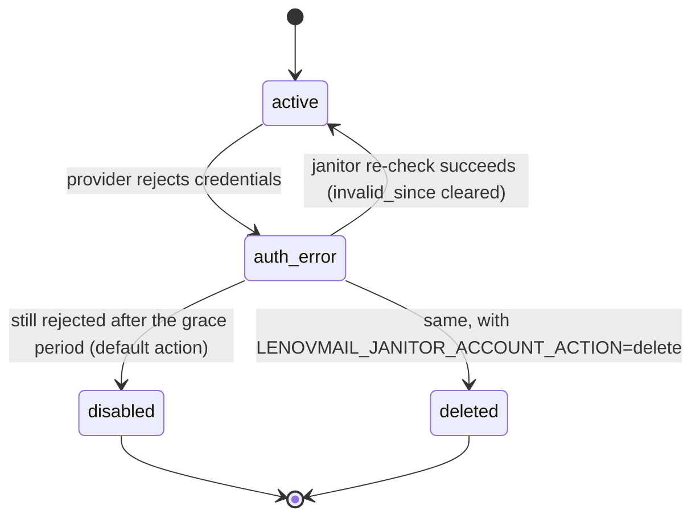

# Operations

## Jobs and cron schedule

All jobs are registered in `src/lenovmail/workers/main.py::WorkerSettings` and run in
the `arq` worker process. `max_jobs` is `LENOVMAIL_WORKER_MAX_JOBS` (default `10`,
concurrent jobs per worker), `job_timeout` is `LENOVMAIL_WORKER_JOB_TIMEOUT_S`
(default `900`).

| Job | Trigger | What it does |
|---|---|---|
| `sync_all_accounts` | cron: `second={0, 30}`, `run_at_startup=True` | Enqueues `sync_account` for every account whose `last_sync_at` has passed `sync_interval_s` (or is `NULL`). |
| `sync_account` | enqueued by `sync_all_accounts`, `idle_watch`, or a GUI "sync now" action | One full cycle for one account: folder reconciliation, header pass + flag refresh per folder, then body backfill. IMAP path: `workers/tasks.py::_sync_imap_account`. Graph path: `_sync_graph_account`. |
| `backfill_bodies` | on demand (not scheduled) | Body backfill only, for one folder or a whole account — used when a caller wants bodies without a full header re-sync. |
| `ensure_idle_watchers` | cron: `minute=set(range(0, 60, 5))` (every 5 minutes) | Enqueues `idle_watch` for every active IMAP account that doesn't already hold the Redis key `idle:watch:<account_id>`. |
| `idle_watch` | enqueued by `ensure_idle_watchers` | Long-lived job (own timeout: `IDLE_WATCH_TIMEOUT_S = 3600`, far above the global `job_timeout`) holding one IMAP `IDLE` connection on the account's inbox (or first pinned folder). Refreshes the Redis lock every `LENOVMAIL_IDLE_RENEW_S` seconds (default `1500`) and triggers `sync_account` inline when the server reports a change. |
| `deliver_outbox` | enqueued by the API when an `outbox` row becomes `queued` (send or approve) | Sends up to 10 oldest `queued` rows for one account via `sync/outbox.py::send_pending`. |
| `janitor_sweep` | cron: `minute={17}` (hourly, offset so it never queues behind the `:00`/`:30` sync fan-out) | Runs `maintenance.run_sweep`: re-checks `auth_error` accounts, purges dead agent tokens and old audit rows. Same logic as `lenovmail janitor`. |

## Janitor: account lifecycle

The sync path marks an account `auth_error` the moment a provider rejects its
credentials (`MailAuthError`, `AccountConfigError`, or `GraphAuthError`/401/403).
Nothing else changes that status automatically — the janitor (`maintenance.py`) is
what re-checks it, recovers it, or retires it.



Only rows already `auth_error` are probed — a healthy account is never touched by the
janitor. On the first confirmed rejection, `accounts.invalid_since` is stamped; it is
cleared the moment the account answers again. Once `now - invalid_since` exceeds
`LENOVMAIL_JANITOR_ACCOUNT_GRACE_DAYS` (default `14`), the account is retired
according to `LENOVMAIL_JANITOR_ACCOUNT_ACTION` (default `disable`; `delete` also
removes its mail by cascade — opt in deliberately). A provider check that comes back
inconclusive (timeout, DNS failure, 5xx) is logged as `unreachable` and leaves the
row untouched — only a confirmed 401/403-class rejection counts as invalid, so an hour
of provider downtime does not retire every mailbox.

`accounts.status = 'error'` (distinct from `auth_error`) is a separate, always-transient
state set by `sync_account` when a folder or connection attempt fails for a reason
that isn't a credential rejection (e.g. the IMAP server was unreachable for this
cycle). It clears itself on the next successful sync and is never touched by the
janitor.

Each sweep also purges agent tokens revoked or expired more than
`LENOVMAIL_JANITOR_TOKEN_RETENTION_DAYS` (default `7`) days ago, and trims
`agent_audit` to `LENOVMAIL_JANITOR_AUDIT_RETENTION_DAYS` (default `90`; `0` keeps
every row forever — `agent_audit.token_id` is `ON DELETE SET NULL`, so the audit trail
outlives a purged token).

### Running a sweep manually

```console
$ uv run lenovmail janitor
checked            3
recovered          1
quarantined        0
disabled           1
deleted            0
unreachable        0
tokens_deleted     4
audit_rows_deleted 112
```

Override the retire action for one run without changing
`LENOVMAIL_JANITOR_ACCOUNT_ACTION`:

```console
$ uv run lenovmail janitor --action delete
```

The same sweep runs automatically every hour at minute `17` as the `janitor_sweep` arq
cron job — the CLI command is for on-demand runs (after fixing a credential, before a
release, etc.), not a substitute for the worker process.

## Health checks

```console
$ curl -s http://localhost:8080/api/healthz | jq
{
  "status": "ok",
  "database": true,
  "redis": true,
  "version": "0.1.0"
}
```

`GET /api/healthz` (`api/routes/system.py`) runs `SELECT 1` against Postgres and
`PING` against Redis. `status` is `"ok"` only if both succeed; otherwise
`"degraded"`. This is what the Docker healthcheck and the GUI use to surface an
infrastructure problem — it does not check individual mail accounts (use
`lenovmail show-account <email>` or the `accounts` table for that).

## Logs to grep

Logging is structured JSON to stdout (`logging.py`, one line per event via
`structlog`). Useful event names (`event` field):

| Event | Source | Meaning |
|---|---|---|
| `janitor_account_quarantined` | `maintenance.py` | An account's `invalid_since` was just stamped — first confirmed credential rejection. |
| `janitor_account_recovered` | `maintenance.py` | A previously `auth_error` account answered again and is back to `active`. |
| `janitor_account_disabled` / `janitor_account_deleted` | `maintenance.py` | An account was retired after the grace period. |
| `janitor_check_inconclusive` | `maintenance.py` | The provider check timed out or errored transiently; the account was left untouched. |
| `sync_account_pool_transient` / `sync_account_folders_transient` / `sync_account_folder_transient` / `sync_account_bodies_transient` | `workers/tasks.py` | A sync step failed with a transient (non-auth) error; the account is marked `error` and retried on the next scheduled cycle. |
| `sync_folder_failed` / `graph_sync_folder_failed` | `sync/imap_sync.py` / `sync/graph_sync.py` | One folder's cycle failed; `folders.sync_error` was set. |
| `uidvalidity_changed` | `sync/imap_sync.py` | A folder's `UIDVALIDITY` changed server-side; the folder was wiped and resynced from scratch. |
| `graph_delta_expired` | `sync/graph_sync.py` | Graph rejected the stored delta link (410 / expired token); the folder fell back to a full delta. |
| `graph_body_fallback` | `sync/graph_sync.py` | Graph refused `/$value` for a message body; metadata-only partial storage was used instead. |
| `idle_watch_no_folder` | `workers/tasks.py` | `idle_watch` found no inbox or pinned folder for the account and exited without watching anything. |
| `idle_watch_reconnect` | `workers/tasks.py` | The IDLE connection dropped; reconnecting with backoff (`5, 10, 20, 40, 60` seconds). |
| `idle_watch_giving_up` | `workers/tasks.py` | The backoff steps are spent, so the watcher returns and frees its worker slot; `ensure_idle_watchers` starts a new one within five minutes. Repeating for one account means that mailbox is unreachable. |
| `idle_watch_sync_failed` | `workers/tasks.py` | `sync_account` triggered by an IDLE change notification raised; logged, not fatal to the watcher. |
| `append_to_sent_failed` | `sync/outbox.py` | A sent message could not be copied into the account's Sent folder (send itself still succeeded). |
| `agent_audit_failed` / `mcp_audit_failed` | `api/app.py` / `mcp/server.py` | Writing an `agent_audit` row failed; the underlying API/MCP call still completed. |
| `worker_startup` / `worker_shutdown` | `workers/main.py` | Worker process lifecycle. |
| `api_started` | `api/app.py` | API process finished startup (includes whether the built GUI was found). |

## Backup and restore

Two things need to be backed up together, or the data becomes unusable:

1. **Postgres** — all structured data, including encrypted credentials and delta
   cursors.
   ```console
   $ docker compose exec db pg_dump -U lenovmail lenovmail > lenovmail.sql
   $ docker compose exec -T db psql -U lenovmail lenovmail < lenovmail.sql
   ```
2. **`LENOVMAIL_BLOB_ROOT`** — raw MIME bodies, content-addressed
   (`<sha256[0:2]>/<sha256[2:4]>/<sha256>.eml.gz`). In `docker-compose.yml` this is the
   named volume `blobs` mounted at `/var/lib/lenovmail/blobs`; locally it is
   `./var/blobs` unless overridden.
   ```console
   $ docker run --rm -v lenovmail_blobs:/from -v "$PWD":/to alpine \
       tar czf /to/blobs.tgz -C /from .
   ```

`LENOVMAIL_SECRET_KEY` is not stored in either — keep it in whatever secret manager
provisions `.env`/environment variables. Losing it makes every encrypted column
(passwords, Graph token caches, delta links) permanently unreadable; a restored
database is otherwise intact but every account will resync from scratch and IMAP/SMTP
passwords will need to be re-entered.

## Troubleshooting

| Symptom | Likely cause | Check / fix |
|---|---|---|
| Account stuck in `auth_error` | Credentials were rejected and the janitor's grace period hasn't elapsed, or the account was probed and is genuinely still invalid. | `accounts.status_detail` and `accounts.invalid_since` for the reason and clock. Grep logs for `janitor_account_quarantined`/`janitor_check_inconclusive` for this `account_id`. Fix the credential in the GUI (this clears `auth_error` back to `active` on the next sync), or run `uv run lenovmail janitor` to force an immediate re-check instead of waiting for the hourly cron. |
| IDLE watcher never starts for an active IMAP account | The account has no `inbox`-role folder and no folder with `is_pinned = true` (`_select_idle_folder` returns `None`, logged as `idle_watch_no_folder`); or `ensure_idle_watchers` hasn't run yet (runs every 5 minutes); or the Redis lock `idle:watch:<account_id>` is stuck from a crashed job. | Confirm the account has a folder with `role='inbox'`. Check `redis-cli exists idle:watch:<account_id>` — the key has a 90s TTL (`IDLE_WATCH_LOCK_TTL_S`) and is refreshed every `idle_renew_s`, so a stale one expires within 90s of the watcher dying; a still-present key past that means the job is genuinely alive. Grep for `idle_watch_reconnect` repeating with no successful IDLE — provider-side blocking or firewall issue. |
| Outbox rows stuck in `sending` | The worker process that claimed the row (`FOR UPDATE SKIP LOCKED`, `status='sending'`, `locked_at=now()`) died mid-send. `_release_stale_claims` resets any claim older than `CLAIM_TIMEOUT_S` (900s) back to `queued`, but that reset only runs at the start of the *next* `deliver_outbox` call — and `deliver_outbox` is only enqueued by the API when a new row is queued or approved for that account. | Wait for the 900s claim timeout, then trigger any new send/approve for the account (or requeue an existing `pending_approval` row) to fire `deliver_outbox` again. To force it immediately, enqueue the arq job by hand (see snippet below the table). |

**Sync lock and queue dedup keys.** Three short-TTL Redis keys track in-flight sync
work: `sync:lock:<account_id>` (`SYNC_LOCK_PREFIX`/`SYNC_LOCK_TTL_S`, 900s) is held by
`sync_account` for the duration of one cycle so a second call for the same account
steps aside instead of racing it; `sync:queued:<account_id>` (`SYNC_QUEUED_PREFIX`/
`SYNC_QUEUED_TTL_S`, 900s) is set by `sync_all_accounts` when it enqueues a job, so the
`:00`/`:30` cron tick does not pile up duplicate jobs for an account that is already
waiting in the queue; `idle:watch:<account_id>` is the IDLE watcher's own liveness key
(see the IDLE watcher row above). A `sync:lock:`/`sync:queued:` key that is still set for
an account with no running job means a worker died mid-cycle; it expires on its own within
900s, or delete it with `redis-cli del` to unblock the account sooner.

**Manual `deliver_outbox` enqueue** (account stuck with no pending GUI action to retrigger it):

```python
import asyncio
from arq import create_pool
from arq.connections import RedisSettings
from lenovmail.config import settings

async def main():
    pool = await create_pool(RedisSettings.from_dsn(settings.redis_url))
    await pool.enqueue_job("deliver_outbox", "<account-uuid>")

asyncio.run(main())
```

---
Maintained by [satuapps](https://satuapps.com).
